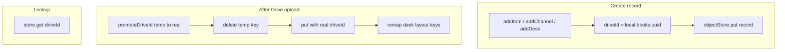
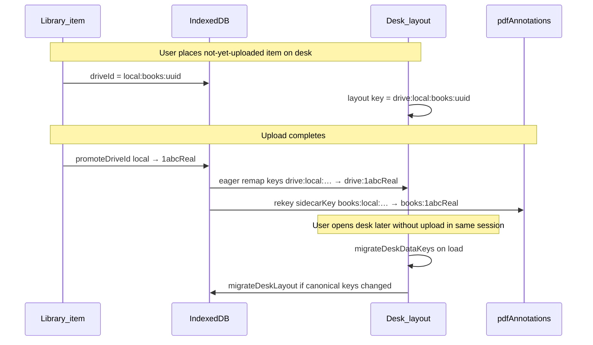

# driveId-only IndexedDB keys

## Goal

Remove numeric `id` as the IndexedDB primary key. Every record is keyed by **`driveId`**:

- **Uploaded:** real Google Drive file ID (e.g. `1abc…`)
- **Not uploaded yet:** temp key with reserved prefix (see below) — never empty string

Desk layouts reference items by **`drive:{driveId}`** from day one, including while `driveId` is still temporary. When the real Google file ID arrives, all related references are updated (eagerly on upload, and again lazily when a desk loads).

Desk layouts, readers, sync, and CRUD all reference **`driveId`** only.

**User choice:** Reader URL breaking change only — no fallback for old `?id=` bookmarks.

### Requirements summary (desk + temp IDs)

1. **Separable temp format** — App-issued IDs use prefix `local:` (e.g. `local:books:550e8400-e29b-…`). Google Drive file IDs never start with `local:`, so `isTempDriveId()` is reliable with no collision.
2. **Desk uses temp ID first** — When user drops an item on the canvas before upload, layout stores `drive:local:books:uuid` (same key shape as after upload; only the suffix changes).
3. **Auto-replace on next desk load** — On desk open, `migrateDeskDataKeys` compares each layout key to the item’s current `driveId`; if the item now has a real Google ID, rewrite `drive:local:…` → `drive:1abcReal` and save via `migrateDeskLayout` (no backup-dirty flag). Upload path also remaps immediately via `promoteDriveId` (eager).

**Example desk `layout` JSON:**

```js
// Before upload
{ "drive:local:books:550e8400-e29b-41d4-a716-446655440000": { x: 120, y: 80 } }

// After upload (same tile position, key updated)
{ "drive:1BxiMVs0XRA5nFMdKvBdBZjU1ysp8GFx": { x: 120, y: 80 } }
```

Full flow: see **Updating related references when a real Drive ID is available** below.

---

## Key design



| Concern | Approach |
|--------|----------|
| Temp key format | **`local:{store}:{suffix}`** — reserved prefix; Google file IDs never use this form (see below) |
| Real Drive IDs | Opaque alphanumeric strings from Drive API (e.g. `1BxiMVs0XRA5…`); **must not** start with `local:` |
| `driveId` index | **Removed** — redundant when `driveId` is keyPath |
| Channels | Same PK model; keep **`channelId`** unique index for YouTube dedup |
| PDF annotations | `sidecarKey` → `` `${idbStore}:${pdfDriveId}` `` where `pdfDriveId` is the PDF record’s `driveId` (temp or real) |
| Legacy `images` store | `noteId` index → **`noteDriveId`** (string) |

New helper module: [`utils/driveRecordKey.js`](utils/driveRecordKey.js)

```js
export const TEMP_PREFIX = 'local:';

/** True for app-issued keys; false for Google Drive file IDs. */
export function isTempDriveId(d) {
  return String(d || '').trim().startsWith(TEMP_PREFIX);
}

/** New imports: local:books:<uuid> */
export function makeTempDriveId(store) {
  return `local:${store}:${crypto.randomUUID()}`;
}

/** v9→v10 migration only: local:books:5 preserves desk links from old numeric id */
export function migrationTempDriveId(store, oldNumericId) {
  return `local:${store}:${oldNumericId}`;
}

/** Layout / URL safety: drive:local:books:uuid (encodeURIComponent on query params) */
export function deskLayoutKey(driveId) {
  return `drive:${String(driveId || '').trim()}`;
}

export function parseDeskLayoutKey(key) {
  return key?.startsWith('drive:') ? key.slice(6).trim() : '';
}
```

### Temp ID vs Google Drive ID (separation guarantee)

| | Temp (app-issued) | Google Drive file |
|--|--|--|
| **Pattern** | `local:{store}:{suffix}` | `[A-Za-z0-9_-]+` (opaque; **never** starts with `local:`) |
| **Examples** | `local:books:a1b2-…`, `local:channels:3` (v9 migration only) | `1GxYz9K_abc123DEF` |
| **Detection** | `isTempDriveId(d) === true` | `!isTempDriveId(d) && d.length > 0` |
| **IDB keyPath** | Same field `driveId` — distinguished by prefix only |
| **Sent to Drive API?** | **Never** — only real IDs in upload/ACL/index | Yes |

**Why `local:` prefix:** Reserved namespace chosen so it cannot collide with Google-issued file IDs. All app logic branches on `isTempDriveId()` instead of heuristics (length, charset). Owner index and share ACLs **omit** rows until `!isTempDriveId(driveId)`.

**Desk layout namespace:** Canvas keys are always `drive:{driveId}` — the `drive:` prefix is layout-only; the segment after it is the raw IDB `driveId` (temp or real). Do not use bare `local:books:uuid` as a layout key for new data.

Google’s file IDs are never issued with a `local:` prefix, so a single `driveId` string field can hold either state without ambiguity.

**Stores using temp keys:** `books`, `notes`, `videos`, `channels`, `desks` (each with its own `{store}` segment).

---

## Updating related references when a real Drive ID is available

Two complementary paths (both should be implemented):



### 1. Eager promotion (upload / sync path)

When backup or tile upload assigns a real Drive file ID, [`promoteDriveId`](hooks/useIndexedDB.js) (renamed from `setItemDriveId`):

1. **Record:** `get(tempDriveId)` → `delete(tempDriveId)` → `put({ ...record, driveId: realDriveId })`
2. **All desks:** For every desk row, [`deskRecordRemapContentKeys`](utils/deskEntryKeys.js) rewrites:
   - `layout` keys: `drive:local:books:uuid` → `drive:1abcReal` (preserves `{x,y}`)
   - `connections[].fromKey` / `toKey` likewise
   - Use `layoutKeysForTempRecord(storeName, tempDriveId)` → `[deskLayoutKey(tempDriveId)]` (replaces numeric `layoutKeysForLocalRecord`)
3. **PDF annotations:** If MIME is PDF, rekey `pdfAnnotations` row from `` `${store}:${tempDriveId}` `` to `` `${store}:${realDriveId}` ``; update `pdfDriveId` field inside sidecar
4. **Reload:** `loadAll()` when any desk was touched (existing behavior)

Runs in the same transaction batch as today’s `setItemDriveId` desk scan — no user action required.

### 2. Lazy promotion (desk load path) — auto-replace temp layout keys

Handles: upload finished while desk tab was closed; sync on another device; eager remap missed a desk row; or user reopens desk days later.

On **every desk open** (and when `items` / `channels` / `desks` refresh), keep the effect in [`components/Desk.js`](components/Desk.js) (~L757–794) and adapt it to use `desk.driveId` instead of `desk.id`:

```
onMigrateDeskLayout(deskDriveId, newLayout, newConnections)  // no localModifiedAt bump
```

**`migrateDeskDataKeys` algorithm** (update in [`utils/deskEntryKeys.js`](utils/deskEntryKeys.js)):

```
for each oldKey in layout:
  entry = resolveLayoutEntry(oldKey, items, channels, desks)
  if entry is pending: continue   // deleted item or not loaded yet — keep key, don't remap

  canon = deskLayoutKey(entry.driveId)   // e.g. drive:1abcReal or drive:local:books:uuid
  if canon !== oldKey:
    keyMap[oldKey] = canon               // stale temp → real (or legacy → canonical)

rewrite layout positions using keyMap
rewrite connections[].fromKey / toKey using keyMap
return { layout, connections, changed: keyMap.size > 0 }
```

**`resolveLayoutEntry` for `drive:` keys** (replace numeric-id branches for new data):

1. Parse `parsedId = key.slice(6)` (the raw `driveId`, temp or real).
2. Find first row in `items` / `channels` / `desks` where `trim(row.driveId) === parsedId`.
3. Return entry with `_entryType`; do **not** treat `isTempDriveId(parsedId)` as “pending” — temp IDs are valid references.

**Example lazy replace (user story):**

| Step | Item `driveId` | Desk layout key |
|------|----------------|-----------------|
| User drops EPUB on canvas | `local:books:550e8400-…` | `drive:local:books:550e8400-…` |
| User closes desk; backup runs | `1BxiMVs0XRA5…` (real) | still `drive:local:books:550e8400-…` (stale) |
| User opens desk next day | `1BxiMVs0XRA5…` | effect runs → `migrateDeskDataKeys` → key becomes `drive:1BxiMVs0XRA5…`, **same `{x,y}`** |

**Placing a new tile before upload:** [`itemEntryKey`](utils/deskEntryKeys.js) always returns `deskLayoutKey(item.driveId)`; new imports already have `driveId = local:books:uuid`, so the desk never uses a separate layout namespace (no bare `books:5` for new data).

**Resolve while temp:** Tile renders from local blob; `_pendingUpload` only when an upload is actively running (`useDriveTileUpload`), not merely because `isTempDriveId` is true.

**Resolve after promote (eager or lazy):** Same tile position; key suffix changes from `local:…` to Google id; content resolves via `record.driveId`.

**Race guard (keep existing Desk behavior):** If layout has `drive:` keys that `resolveLayoutEntry` cannot match yet (items still loading after `loadDesks`), do not overwrite `layoutRef` on same-desk refresh — avoids flashing tiles hidden. Temp→real migration runs once `items` includes the promoted row.

### Related artifacts checklist

| Artifact | Temp state | After real Drive ID |
|----------|------------|---------------------|
| IDB content row | `keyPath = local:…` | `keyPath = 1abcReal` (delete + put) |
| Desk `layout` / `connections` | `drive:local:…` | `drive:1abcReal` (eager + lazy) |
| `pdfAnnotations.sidecarKey` | `books:local:…` | `books:1abcReal` |
| Note `assets[].driveId` | per-asset temp or real | unchanged until each asset uploads |
| Drive owner index | entry omitted until real | `{ driveId: 1abcReal, … }` |
| Reader URL | `?driveId=local:books:…` | `?driveId=1abcReal` (breaking; no `id` param) |

Nested desk: temp desk row `local:desks:uuid` → layout key `drive:local:desks:uuid`; promotes like any other record.

### Legacy layout keys (v9 → v10 only)

One-time upgrade rewrite (not used for new data):

- `books:5` / `local:books:5` → `drive:local:books:5` (using `migrationTempDriveId`)
- `channel:3` → `drive:local:channels:3`
- `desk:2` → `drive:local:desks:2`

After v10, **only** `drive:{driveId}` keys are written.

---

## Schema migration (v10)

Bump [`utils/infodepoDb.js`](utils/infodepoDb.js) to **version 10**.

In [`hooks/useIndexedDB.js`](hooks/useIndexedDB.js) `onupgradeneeded` (oldVersion &lt; 10):

1. For each store `books`, `notes`, `videos`, `channels`, `desks`:
   - `getAll()` from existing store
   - For each row: set `driveId = trim(driveId) || migrationTempDriveId(store, row.id)`; **delete `id`**
   - Build `oldId → driveId` map for notes (for images migration)
   - `deleteObjectStore(name)` then `createObjectStore(name, { keyPath: 'driveId' })`
   - Re-add `channelId` unique index on `channels` only
   - `put` all migrated rows
2. **`pdfAnnotations`:** recreate with same keyPath `sidecarKey`; rekey each row to `` `${idbStore}:${pdfDriveIdFromMap}` `` using migrated PDF row’s `driveId`
3. **`images`:** migrate `noteId` → `noteDriveId` via notes map; recreate index

**Note:** IndexedDB cannot change `keyPath` in place — delete/recreate per store in one upgrade transaction is required. Warn users to close other tabs (existing `onblocked` handler).

---

## Core DB layer changes ([`hooks/useIndexedDB.js`](hooks/useIndexedDB.js))

| API | Change |
|-----|--------|
| `addItem` | Assign `makeTempDriveId(store)`; `put` (not `add` returning auto-id) |
| `addChannel` / `addDesk` | Same temp `driveId` on create |
| All `os.get(id)` / `delete(id)` | Use `driveId` parameter (rename params in exports for clarity: `driveId` not `id`) |
| `getBookByDriveId` | `os.get(driveId)` per store (no secondary index) |
| `setItemDriveId` → **`promoteDriveId`** | If `newDriveId !== oldDriveId`: get by old key → `delete(old)` → `put({ ...record, driveId: new })` → remap desk keys from `drive:{old}` to `drive:{new}` → rekey PDF sidecar if PDF |
| `deleteItem` / `deleteChannel` / `deleteDesk` | Accept `driveId` |
| `pdfAnnotationSidecarKey` | `` (driveId, idbStore) => `${idbStore}:${driveId}` `` |
| `addImage(noteDriveId, …)` | `os.get(noteDriveId)` |
| `loadItems` | Do **not** expose `id`; consumers use `driveId` |

Remove `layoutKeysForLocalRecord` numeric-id paths from promote flow; use temp `driveId` string instead.

---

## Desk layout keys ([`utils/deskEntryKeys.js`](utils/deskEntryKeys.js))

- **`itemEntryKey` / `channelEntryKey` / `deskEntryKey`:** always `deskLayoutKey(record.driveId)` → `drive:{driveId}` (temp or real)
- **`resolveLayoutEntry`:** parse `drive:` suffix → find row where `trim(record.driveId) === parsedId` (no numeric-id branch for new code)
- **`migrateDeskDataKeys`:** on each desk load, rewrite any key whose resolved entry’s `driveId` no longer matches the key suffix (temp → real promotion)
- **`layoutKeysForTempRecord(storeName, tempDriveId)`:** returns `[deskLayoutKey(tempDriveId)]` for eager `promoteDriveId` remap (replaces `layoutKeysForLocalRecord`)
- Remove legacy `local:…` / `channel:N` / bare `store:N` **parsers** after v10 upgrade rewrites saved layouts; keep a short-lived legacy branch inside `resolveLayoutEntry` only if needed during migration testing

See **Updating related references** above for eager vs lazy flows.

---

## Reader / standalone entrypoints

| File | Change |
|------|--------|
| [`App.js`](App.js) `openItem` | `reader.html?driveId=…&store=…`; progress key = `video.driveId` |
| [`reader-entry.js`](reader-entry.js) | Query `driveId`; `getItem(db, driveId, store)` |
| [`pdf-reader-entry.js`](pdf-reader-entry.js) | Same; sidecar uses new key helper |
| **No** legacy `?id=` fallback (per user choice) |

---

## Call-site sweep (~25 files)

Replace `item.id` / `video.id` / `rec.id` / `desk.id` / `ch.id` with **`driveId`** for IDB and React `key` props:

- [`App.js`](App.js), [`components/Library.js`](components/Library.js), [`components/Desk.js`](components/Desk.js), [`components/Reader.js`](components/Reader.js), [`components/PdfViewer.js`](components/PdfViewer.js), [`components/MarkdownEditor.js`](components/MarkdownEditor.js), [`components/DataTile.js`](components/DataTile.js) (SVG pattern id can use `driveId`), [`hooks/useDriveTileUpload.js`](hooks/useDriveTileUpload.js), [`utils/driveSync.js`](utils/driveSync.js), [`utils/libraryDriveSync.js`](utils/libraryDriveSync.js), [`utils/peerSync.js`](utils/peerSync.js), [`components/YoutubeChannelViewer.js`](components/YoutubeChannelViewer.js), etc.

**`onSetDriveId` signature** (keep name for minimal churn):

```js
onSetDriveId(oldDriveId, storeName, newDriveId, syncMeta)
```

All callers pass `item.driveId` / `ch.driveId` / `desk.driveId` as first argument.

**`utils/driveSync.js` owner-index slim entries:** drop `id` field; keep `driveId` only.

**PDF sidecar JSON on Drive:** [`utils/pdfAnnotationSidecar.js`](utils/pdfAnnotationSidecar.js) — serialize `itemDriveId` (string); parse accepts legacy numeric `itemId` **and** new `itemDriveId` for pulled sidecars.

---

## Documentation

Update [`documents/data-stores.md`](documents/data-stores.md), [`CLAUDE.md`](CLAUDE.md), [`utils/infodepoDb.js`](utils/infodepoDb.js) header — remove `id` from record shapes; document temp key format and v10 migration.

---

## Verification

1. Fresh DB: import local EPUB → temp `local:books:…` → place on desk (`drive:local:…`) → upload → desk key becomes `drive:1abcReal` without moving tile
2. Lazy path: upload item, reload app, open desk → `migrateDeskDataKeys` rewrites any stale `drive:local:…` keys
3. v9 → v10 upgrade: existing library + desk layouts still resolve
3. `reader.html?driveId=…` opens EPUB/PDF (local blob and lazy Drive download)
4. Sync pull/backup + peer prune by `driveId`
5. PDF annotations survive promote (sidecar rekey)

```bash
npm run dev
# manual: import, desk place, backup, open reader tab, reload
```

---

## Out of scope / risks

- **Broken bookmarks** for old `reader.html?id=` URLs (accepted)
- **Multi-tab** during v10 upgrade — user must close extra tabs
- **images** legacy store: migrated but still low-traffic; new notes use `note.assets`
