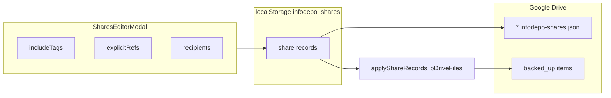

# Shares store, Drive JSON, and editor

## IndexedDB version constraint

**Do not bump `INFO_DEPO_DB_VERSION`.** Adding a new object store would normally require a higher DB version and `onupgradeneeded`; skipping the bump means we **do not** add a `shares` object store to IndexedDB.

**Persistence instead:** keep a `**shares` registry in `localStorage`** (e.g. key `infodepo_shares_v1`, value JSON array). The hook exposes the same conceptual API (`loadShares`, `addShare`, `updateShare`, `deleteShare`); each record uses a stable string or numeric `id` assigned in app logic (e.g. `crypto.randomUUID()` or monotonic counter). `**clearAll`** must also remove this key so “clear library” wipes share configs.

Optional later: migrate to IndexedDB when/if a future schema change bumps the DB version and adds a real `shares` store.

## Data model

**Client registry (`localStorage`)**

- Suggested record shape (single source of truth for the editor UI):

| Field                                               | Purpose                                                                                                       |
| --------------------------------------------------- | ------------------------------------------------------------------------------------------------------------- |
| `id`                                                | Stable id (string), client-generated                                                                          |
| `driveFileName`                                     | Target filename in Drive, e.g. `Team.infodepo-shares.json` (also used as the share’s display title in lists)  |
| `driveFileId`                                       | Drive file id after first upload, or set when **receiver** links an existing file                             |
| `recipients: string[]`                              | **Only** way to specify who receives access: normalized **emails**; UI may use `mailto:` links per address    |
| `includeTags: string[]`                             | Tags whose matching content is included (same semantics as `[collectDriveIdsForTag](utils/shareManifest.js)`) |
| `explicitRefs: { name: string, driveId: string }[]` | Direct picks (library rows that have `driveId`)                                                               |
| `role: 'owner'                                      | 'receiver'`                                                                                                   |
| `updatedAt`                                         | ISO string for display / conflict hints                                                                       |

- Expose CRUD helpers from `[hooks/useIndexedDB.js](hooks/useIndexedDB.js)` (or a small `[utils/sharesRegistry.js](utils/sharesRegistry.js)` imported by the hook) and load on app init so Library can render.

**Drive JSON file (versioned contract)**

- Define a small schema in a dedicated module e.g. `[utils/sharesDriveJson.js](utils/sharesDriveJson.js)`: `version`, `driveFileName` (or filename metadata), `recipients` (emails only), `includeTags`, `explicitRefs` (name + driveId), `updatedAt` (and optionally mirror local `id`). **No separate `label`.** “Who to share with” = `**recipients` emails only**.
- Serialize/deserialize with validation; reject unknown versions.
- Upload/download via same multipart pattern as `[uploadShareManifest](utils/shareManifest.js)` (create or PATCH by `driveFileId`), parent folder = existing linked folder from `[driveFolderStorage.js](utils/driveFolderStorage.js)` / credentials flow.

## Drive ACLs (`[utils/driveSharePermissions.js](utils/driveSharePermissions.js)`)

- Today, `[applyTagSharesToDriveFiles](utils/driveSharePermissions.js)` expects `**tagSharesRows: { tag, emails[] }[]`** and uses `[buildFileToDesiredReaders](utils/shareManifest.js)` + revoke helpers.
- **Add a parallel entry point** (e.g. `applyShareRecordsToDriveFiles`) that:
  - Builds `**Map<fileId, Set<email>>`** by:
    - For each **share record** with `role === 'owner'`, union recipients onto:
      - Drive ids from each **tag** via existing `collectDriveIdsForTag` (needs merged items + images + channels).
      - Drive ids from **explicitRefs** (and note images: optionally mirror tag logic for notes—if an explicit note is included, include embedded image refs like `collectDriveIdsForTag` does for consistency).
  - Builds **recipient universe** + **all file ids** for revoke (reuse `collectAllDriveFileIdsForReconcile`-style logic but driven by **previous** JSON blobs fetched from Drive before overwrite, or a simplified “previous snapshot” stored in memory during the sync pass).
- Reuse the inner grant/revoke loops already in `applyTagSharesToDriveFiles` by extracting shared helpers if needed to avoid duplication.
- **OAuth scope risk:** `drive.file` may be insufficient to add permissions on arbitrary files in a shared folder. If the Permissions API returns 403 for non–app-created files, document that **full `drive` scope** (or sharing only files created by the app) may be required—verify during implementation against [Google’s scope docs](https://developers.google.com/drive/api/guides/about-auth).

## UI / UX

**“+ Add Content” (`[components/Library.js](components/Library.js)`)**

- Add two entries under the existing Add Content dropdown (or equivalent):
  1. **New share** — opens editor with empty record (`role: 'owner'`), generates default `driveFileName` (no separate display label beyond filename).
  2. **Link share…** — prompts for Drive file id or uses Drive picker if you already have a pattern; fetches JSON, validates, saves share row with `role: 'receiver'`, `driveFileId` set.

**Shares UI (new component, e.g. `[components/SharesEditorModal.js](components/SharesEditorModal.js)`) — mode by `role`**

- **Owner — editor:** full controls (recipients, tags, explicit items); **Save** → JSON upload + registry + `**applyShareRecordsToDriveFiles`** (or separate “Apply Drive access”).
- **Receiver — viewer only:** read-only display of linked JSON (recipients, tags, refs); no Save, no upload, no ACLs; optional **Remove link** / **Refresh** from Drive.

**Library surface**

- Toolbar **“Shares”** list: owner rows **Edit** / **Delete**; receiver rows **View** / **Remove link**.

## App wiring

- `[App.js](App.js)`: pass new hook exports into `Library` (or a thin wrapper) for shares state and mutations.

## Documentation

- Update `[documents/data-stores.md](documents/data-stores.md)` (describe `shares` as **localStorage**, not a new IDB store; keep IDB version **1**) and briefly `[documents/components.md](documents/components.md)` for the new UI—only after implementation, per your doc conventions.

## Implementation order

1. `utils/sharesDriveJson.js` + `localStorage` registry + hook CRUD + `clearAll` integration.
2. Drive upload/download helpers for the share JSON file.
3. `buildDesiredReadersFromShareRecords` (or equivalent) + `applyShareRecordsToDriveFiles` in `[driveSharePermissions.js](utils/driveSharePermissions.js)`.
4. `SharesEditorModal` (owner editor + receiver viewer via `role` / `readOnly`) + Add Content / toolbar integration in `Library.js`.
5. Manual test: owner save → recipients get reader on listed files; receiver link → JSON parses.

