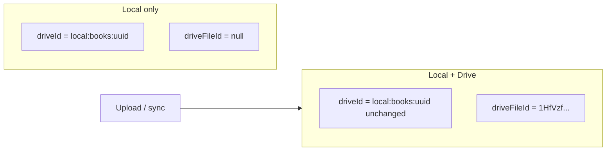

# Stable Local Keys + driveFileId

## Design decision (user choice: A)

- **`driveId`** — permanent app key (`local:books:{uuid}`), never replaced after upload
- **`driveFileId`** — Google Drive file id; `null`/absent = local-only; set after upload/sync
- **Desk layout keys** — always `drive:{driveId}` using the local `driveId`
- **Layout values** — extend from `{ x, y }` to `{ x, y, driveFileId? }` so desks synced cross-device can be remapped on pull by matching `driveFileId` to local rows



## Two-state model

| State | `driveId` | `driveFileId` | Desk layout key |
|-------|-----------|---------------|-----------------|
| Local only | `local:…` | absent | `drive:local:…` |
| Both places | `local:…` (same) | Google file id | `drive:local:…` (+ `driveFileId` in value after upload) |

Replace `isTempDriveId(driveId)` checks with **`!record.driveFileId`** (“not on Drive yet”) everywhere that means upload/sync eligibility.

---

## Phase 1 — Schema + migration (v11)

**Files:** [`hooks/useIndexedDB.js`](hooks/useIndexedDB.js), [`utils/infodepoDb.js`](utils/infodepoDb.js)

1. Bump DB to **v11**.
2. Add non-key field **`driveFileId`** on `books`, `notes`, `videos`, `channels`, `desks`, `images`.
3. Add **`driveFileId` index** on each content store (for pull/sync lookup by Google id).
4. **Migration from v10 (content rows):**
   - Rows where `driveId` does **not** start with `local:` → treat current `driveId` as `driveFileId`, assign new `driveId = makeTempDriveId(store)`.
   - Rows already `local:…` → `driveFileId` stays null until next sync/upload fills it.
5. **Migration from v10 (desk layouts):** run `normalizeDeskLayoutV11` on every desk row (see Phase 2b) — this is the compatibility bridge for current layouts.
6. PDF sidecars: keep `sidecarKey = ${idbStore}:${driveId}` (stable local id); `pdfDriveId` in payload remains Google PDF file id.

---

## Phase 2 — Stop promote/remap on upload

**Files:** [`hooks/useIndexedDB.js`](hooks/useIndexedDB.js), [`utils/deskEntryKeys.js`](utils/deskEntryKeys.js)

Replace **`setItemDriveId(old, store, newGoogleId)`** promote semantics with **`setDriveFileId(localDriveId, store, driveFileId, meta)`**:

- In-place `put`: `{ …record, driveFileId, modifiedTime, localModifiedAt }` — **no delete+put**, no key change
- **Remove** calls to `deskRecordRemapContentKeys`, `layoutKeysForTempRecord`, `rekeyPdfAnnotationSidecarOnPromote`
- After upload, patch **current desk layout values** (not keys): set `driveFileId` on the tile at `drive:{localDriveId}`

**Delete or no-op:**
- `migrateDeskDataKeys` temp→real key rewrite (replace with cross-device remapper only)
- `deskRecordRemapContentKeys`
- `layoutKeysForTempRecord`

**Keep:** `resolveLayoutEntry` parsing `drive:` → lookup by **local `driveId`** only.

---

## Phase 2b — Current desk layout compatibility (required)

Existing desks in IndexedDB and on Drive may use **any** of these key shapes. The new system must normalize all of them without losing tile positions or connections.

### Layout key formats in the wild

| Key example | Origin | v11 target |
|-------------|--------|------------|
| `drive:local:books:uuid` | v10 temp import | **Keep key**; add `driveFileId` to value after upload |
| `drive:1HfVzfBrAFjG99hvNQZdCtnvn4zpfQVt0` | v10 after promote | **Rewrite key** → `drive:{newLocalDriveId}`; value `{ x, y, driveFileId: "1HfVzf…" }` |
| `drive:local:books:dff94977-…` (user’s desk) | v10 local-only | **Keep key**; `driveFileId` absent until upload |
| `books:5`, `channel:3`, `desk:2` | pre-v10 numeric | Resolve via `resolveLegacyLayoutKey` → local row → canonical `drive:{localDriveId}` |
| `local:books:5` | pre-v10 | Same as above (v10 upgrade may have partially converted) |

Layout **values** today are only `{ x, y }`. v11 normalizes every entry to `{ x, y, driveFileId? }` (preserve `x`/`y`; add `driveFileId` when known).

### Single normalizer: `normalizeDeskLayoutV11(layout, connections, items, channels, desks)`

**File:** [`utils/deskEntryKeys.js`](utils/deskEntryKeys.js) (replaces `migrateDeskDataKeys` promote logic)

Runs in **two places** (same function, idempotent):

1. **DB v11 upgrade** — batch all desk rows in `onupgradeneeded`
2. **Runtime** — `Desk.js` on desk open (and after desk pull from Drive), before `layoutRef` is applied

**Algorithm (per layout entry):**

```
1. Parse key:
   - If legacy (books:5, channel:N, …) → resolveLegacyLayoutKey → record or skip
   - If drive:… → parseDeskLayoutKey → id suffix

2. Classify id suffix:
   a) local:… (temp local driveId) → canonical key = drive:{suffix}
      - If record.driveFileId exists → value.driveFileId = record.driveFileId
   b) Google file id (no local: prefix) → lookup record by driveFileId index
      OR by old v10 driveId==googleId row (during migration)
      - New key = drive:{record.driveId}
      - value.driveFileId = google id (former key suffix)
   c) Unresolvable → keep key temporarily; pending tile + sync will fix via value.driveFileId

3. Normalize value: { x, y, ...(driveFileId ? { driveFileId } : {}) }

4. Rewrite connections: fromKey/toKey through same keyMap built in step 2

5. Dedupe: if two old keys map to same canonical key, keep one position (prefer entry with driveFileId)
```

### Replace `migrateDeskDataKeys` in Desk.js

Today `Desk.js` calls `migrateDeskDataKeys` which rewrites temp→Google keys. Replace with:

```js
const normalized = normalizeDeskLayoutV11(layout, connections, items, channels, desks);
if (normalized.changed && !readOnly) onMigrateDeskLayout(desk.driveId, normalized.layout, normalized.connections);
```

`onMigrateDeskLayout` still persists without bumping `localModifiedAt` (one-time shape fix, not user edit).

### Desk JSON pulled from Drive

When `syncSingleDeskFromDrive` / `upsertDriveDesk` writes a desk row, the layout may still be in **old v10 format** (Google-id keys). Runtime `normalizeDeskLayoutV11` on next open fixes it using local `driveFileId` index — no separate Drive-side migration required.

### User’s current desk example

```
layout:
  drive:local:books:dff94977-…     → unchanged key; driveFileId added on upload
  drive:1HfVzfBrAFjG99hvNQZdCtnvn4zpfQVt0 → key becomes drive:local:books:{newUuid}
                                           value gains driveFileId: 1HfVzf…
  drive:1smgVB8XqL76xqvww2057NFtZKBgcm0GV → same treatment
```

After v11 migration + item rows gaining `driveFileId`, all three tiles resolve on the **same device** without re-placing items.

### Connections compatibility

`connections[].fromKey` / `toKey` use the same key namespace as layout. The normalizer builds a `keyMap: oldKey → canonicalKey` while processing layout and applies it to every connection in the same pass.

---

## Phase 3 — Desk layout cross-device resolution

**Files:** [`utils/deskEntryKeys.js`](utils/deskEntryKeys.js), [`components/Desk.js`](components/Desk.js)

### Layout value shape

```js
// Before: layout["drive:local:books:uuid"] = { x, y }
// After:  layout["drive:local:books:uuid"] = { x, y, driveFileId?: "1abc..." }
```

### New: `remapDeskLayoutByDriveFileId(layout, items, channels, desks)`

On desk open / desk pull from Drive:

1. For each layout entry with `driveFileId` where `resolveLayoutEntry(key)` is pending:
   - Find local row where `trim(record.driveFileId) === driveFileId`
   - Rewrite key to `deskLayoutKey(record.driveId)` preserving `{ x, y, driveFileId }`
2. Drop entries whose `driveFileId` cannot be resolved (tile stays pending until item syncs)
3. Persist via `migrateDeskLayout` when keys changed

### `addItemToDesk` / upload completion

When item gains `driveFileId`, update layout **value** at existing key (no key rewrite).

### `pullMissingDeskLayoutRefs`

Change lookup: match missing tiles by **`driveFileId`** from layout value (not layout key suffix).

---

## Phase 4 — Sync, index, backup

**Files:** [`utils/driveSync.js`](utils/driveSync.js), [`utils/libraryDriveSync.js`](utils/libraryDriveSync.js), [`utils/ownerIndex.js`](utils/ownerIndex.js), [`hooks/useDriveTileUpload.js`](hooks/useDriveTileUpload.js)

| Area | Change |
|------|--------|
| **`classifyChanges`** | `toBackup` when `!driveFileId` or local newer; match index by **`driveFileId`** |
| **`backupChangedItems`** | PATCH `record.driveFileId`; POST when absent; callback sets `driveFileId` only |
| **`pullChangedItems`** | Find existing by **`getByDriveFileId`**; on insert assign new `makeTempDriveId` + set `driveFileId` from index entry |
| **`upsertDriveBook/Channel/Desk`** | Stop `delete(oldKey)+put(newKey)`; merge by `driveFileId` index |
| **`writeOwnerIndex`** | Index entries use **`driveFileId`** as the `driveId` field in JSON (Drive-facing id unchanged for viewers) OR add explicit `driveFileId` field — prefer keeping index `driveId` = Google id for backward compat with existing Drive indexes |
| **`libraryDriveSync` patchByOldDriveId** | Remove; patch `driveFileId` on in-memory rows instead |

**Owner index backward compatibility:** Keep publishing Google id as `driveId` in `_infodepo_index.json` so existing viewers/peers keep working. Local IDB rows map via `driveFileId`.

---

## Phase 5 — UI, ACLs, readers

**Files:** [`App.js`](App.js), [`components/Desk.js`](components/Desk.js), [`components/Library.js`](components/Library.js), [`components/DataTile.js`](components/DataTile.js), [`hooks/useDriveTileUpload.js`](hooks/useDriveTileUpload.js), [`utils/driveSharePermissions.js`](utils/driveSharePermissions.js), [`reader-entry.js`](reader-entry.js), [`pdf-reader-entry.js`](pdf-reader-entry.js)

- **`recordHasDriveCopy`** → `!!record.driveFileId`
- **Lazy download** → fetch `files/{driveFileId}` when `data == null && driveFileId`
- **Share ACLs / explicitRefs** → use `driveFileId` for Drive Permissions API
- **Desk pending tiles** → `_pendingKind: 'upload'` when `!driveFileId`; `'sync'` when `driveFileId` set but row missing locally
- **Reader URLs** (`reader.html?driveId=…`) → pass **local `driveId`**; reader resolves blob via IDB, downloads via `driveFileId` if needed
- **`libraryItemKey`** — keep keyed on local `driveId` (stable React/upload status map)

---

## Phase 6 — Docs + cleanup

Update [`documents/data-stores.md`](documents/data-stores.md), [`documents/drive-synchronization.md`](documents/drive-synchronization.md), [`CLAUDE.md`](CLAUDE.md). Remove obsolete plan references to temp→real layout promotion.

---

## Risk / testing checklist

- v10→v11 migration on library with mixed local + promoted rows
- **Desk with all three key types** (local temp + two Google-id keys) — all tiles visible after upgrade without re-adding items
- Legacy desk on Drive (Google-id layout keys only) — normalizes on pull + open
- Upload local book → `driveId` unchanged, `driveFileId` set, desk tile key unchanged
- Desk synced to second browser → `remapDeskLayoutByDriveFileId` resolves tiles via `value.driveFileId`
- Owner sync: backup local-only, pull remote by index `driveId` (Google id) → lands with new local uuid + `driveFileId`
- Share ACLs still target correct Drive files
- PDF annotations sidecar still loads after upload
