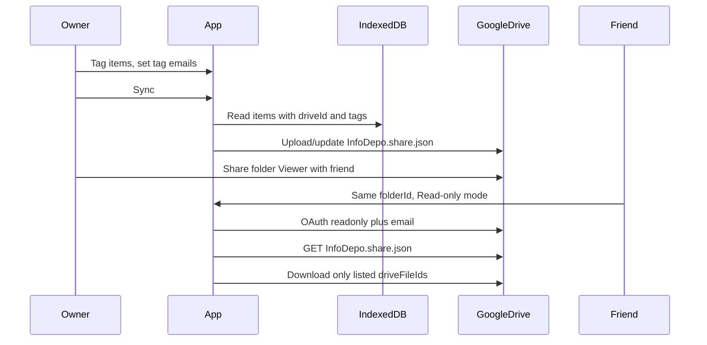

# Tag-based read-only library sharing (Drive)

## Scope (confirmed)

- **Recipients see only items tagged for that share**, not the whole folder. This requires a small **manifest file** in the shared Drive folder (written on owner sync) that lists which Drive file IDs belong to which tag and which emails are associated with each tag.

## How access actually works (constraints)

- **Google Drive sharing** (folder shared with `my_friend@gmail.com` as Viewer) is what grants read access. The app cannot “invite” by email without a backend; the **email on a tag** is used to **match the signed-in Google account** to the right tag’s file list in the manifest.
- The app today has **no user accounts**—only **Google OAuth** for Drive API (`[utils/driveAuth.js](utils/driveAuth.js)`, `[components/Library.js](components/Library.js)`). “Login” for the friend means: OAuth with scopes that allow **listing/downloading** the folder and **reading their Google email** (for matching), not a separate InfoDepo login.

## Data model

1. **IndexedDB (bump version in `[utils/infodepoDb.js](utils/infodepoDb.js)`, migrate in `[hooks/useIndexedDB.js](hooks/useIndexedDB.js)`)**
  - Add optional `tags: string[]` on `books` / `notes` / `videos` / `images` records (default `[]` for existing rows).  
  - Optionally a small `**tagShares` store** or embedded JSON in a single `settings` record: `{ tagName, emails[] }` so the owner can configure “tag `my_friend` → [[friend@gmail.com](mailto:friend@gmail.com)]” without encoding that only in the Drive manifest.
2. **Drive manifest (new artifact)**
  - e.g. fixed filename `InfoDepo.share.json` in the backup folder (same `folderId` as today).  
  - Suggested shape (versioned):

```json
{
  "version": 1,
  "tags": {
    "my_friend": {
      "emails": ["my_friend@gmail.com"],
      "driveFileIds": ["driveId1", "driveId2"]
    }
  }
}
```

- **Only include Drive-backed items** (`driveId` non-empty). Items not yet uploaded cannot be in the manifest until the owner runs Sync/backup.  
- **Notes with images**: if a shared note references images, include those image `driveFileIds` in the same tag (or derive from markdown + folder listing) so recipients get a consistent note.

## Owner flow

1. Tag items in the UI (e.g. chips on cards + editor for tag share settings).
2. For each tag, set **emails** (the intended recipients).
3. **Sync** (existing `[backupAllToGDrive](utils/driveSync.js)` + `[syncDriveToLocal](utils/driveSync.js)` path): after backup/upload, **upsert `InfoDepo.share.json`** from local tags + `driveId` map + email list.
4. Share the **folder** with those Gmail addresses in the **Google Drive UI** (Viewer). Document this in UI copy.

## Recipient flow (read-only)

1. Enter the **same** `clientId`, `apiKey`, `folderId` as today (`[utils/driveCredentials.js](utils/driveCredentials.js)` / `[DriveSettingsModal](components/DriveSettingsModal.js)`).
2. Choose **“Shared library (read-only)”** (or auto-detect Viewer role—see below).
3. OAuth with `**drive.readonly`** + `**userinfo.email`** (or equivalent) so the app can fetch `[userinfo](https://www.googleapis.com/oauth2/v3/userinfo)` and match `email` to a tag in the manifest.
4. Download `InfoDepo.share.json`, resolve the tag for the current user, then **restrict** sync/list/download to `**driveFileIds`** for that tag (reuse download paths from `[syncDriveToLocal](utils/driveSync.js)` / `[DevDriveBrowser](components/DevDriveBrowser.js)` but filtered).
5. **Disable** backup, upload, delete, and edits that write to Drive; local edits could be disabled or clearly “private copy only” to avoid confusion.

**Note:** YouTube **channels** are **not** backed up to Drive per `[documents/data-stores.md](documents/data-stores.md)`; this feature applies to **books / notes / videos / images** that participate in Drive sync.

## OAuth / scope split

- **Owner (full sync):** keep current combined token behavior in `[Library.js](components/Library.js)` (`drive.file` + `drive.readonly`) for backup + sync.  
- **Recipient:** new code path using `**drive.readonly`** + email scope only; no `drive.file` prompt for upload.

## Edge cases to handle in implementation

- **Manifest missing / old version:** fall back to “no shared items” or show a clear error—do not silently show the whole folder if the product promise is tag-only.  
- **Email mismatch:** if OAuth email is not listed under any tag, show an explanatory message (wrong account, or owner forgot to add email).  
- **Security expectation:** this is **obfuscation for UX**, not DRM; anyone with folder access could still use full-folder sync if the app offered it—keep read-only mode explicit.

## Primary files to touch


| Area                         | Files                                                                                                                                                           |
| ---------------------------- | --------------------------------------------------------------------------------------------------------------------------------------------------------------- |
| Schema + tags API            | `[utils/infodepoDb.js](utils/infodepoDb.js)`, `[hooks/useIndexedDB.js](hooks/useIndexedDB.js)`                                                                  |
| Manifest read/write          | New `utils/shareManifest.js` (or under `[utils/driveSync.js](utils/driveSync.js)`), called from `[Library.js](components/Library.js)` sync                      |
| Owner UI                     | `[components/Library.js](components/Library.js)`, `[components/BookCard.js](components/BookCard.js)` or shared card component, new small modal for tag + emails |
| Recipient / mode             | `[App.js](App.js)` or `[Library.js](components/Library.js)`: mode flag in `localStorage`; branch OAuth and sync                                                 |
| Docs (only if you ask later) | `[documents/data-stores.md](documents/data-stores.md)`, `[documents/google-drive-integration.md](documents/google-drive-integration.md)`                        |


## Architecture sketch




