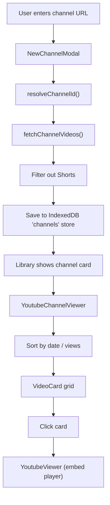

# YouTube Channel Feature

## 1. New IndexedDB Store: `channels`

Since the app hasn't been published yet, no version bump or migration is needed. Add the `channels` store directly in the existing v1 `onupgradeneeded` block in `[hooks/useIndexedDB.js](hooks/useIndexedDB.js)`, alongside the other `addStore()` calls. Users just need to clear site data once to pick up the new store.

**Schema for a `channels` record:**

```js
{
  id: number,              // autoIncrement PK
  channelId: string,       // YouTube channel ID (UC...)
  handle: string,          // e.g. "@stanfordonline"
  name: string,            // channel display name
  thumbnailUrl: string,    // channel avatar URL
  videos: [                // array of video objects
    {
      videoId: string,     // 11-char YouTube video ID
      title: string,
      publishedAt: string, // ISO date
      thumbnailUrl: string,
      viewCount: number,
      duration: string,    // ISO 8601 duration
    }
  ],
  driveId: string,         // '' (for consistency, future backup)
  modifiedTime: Date,
}
```

- Index on `channelId` (unique) to prevent duplicates.
- The `channels` store is **not** merged into the main `items` array -- channels live in a parallel list exposed as `channels` from `useIndexedDB`.

## 2. YouTube Data API v3 Key

Add a new env var `VITE_YOUTUBE_API_KEY` to `.env`. Reference it in a new utility file.

**New file: `[utils/youtubeApi.js](utils/youtubeApi.js)`**

Exports:

- `resolveChannelId(handleOrUrl, apiKey)` -- given a URL like `https://www.youtube.com/@stanfordonline`, extracts the handle and calls the YouTube Data API `channels` endpoint (`forHandle` param) to resolve to a `channelId`. Also handles `/channel/UCxxxx` URLs directly.
- `fetchChannelVideos(channelId, apiKey)` -- uses `search.list` (type=video, channelId, order=date, maxResults=50 with pagination) to get all videos. Filters out Shorts by fetching `videos.list` with `contentDetails` part and excluding duration < 60s. Returns array of video metadata objects including `viewCount` from `statistics` part.

## 3. New Component: Channel Input Modal

**New file: `[components/NewChannelModal.js](components/NewChannelModal.js)`**

- Modal UI matching the style of `[components/NewYoutubeModal.js](components/NewYoutubeModal.js)` (same dark theme, rounded corners, border style).
- Single input field for a YouTube channel URL (validates `youtube.com/@handle` or `youtube.com/channel/...` format).
- On submit: calls `resolveChannelId` then `fetchChannelVideos`, shows a progress spinner, then saves the channel record to the `channels` store via a new `addChannel` function from `useIndexedDB`.
- Displays error messages if the API key is missing or the channel is invalid.

## 4. New Component: `YoutubeChannelViewer.js`

**New file: `[components/YoutubeChannelViewer.js](components/YoutubeChannelViewer.js)`**

Props: `{ channel, onBack }`

- **Header**: Channel name, avatar thumbnail, handle, video count.
- **Sort bar**: Dropdown or segmented control with sort modes:
  - Newest first (default) -- by `publishedAt` descending
  - Oldest first -- by `publishedAt` ascending
  - Most viewed -- by `viewCount` descending
  - Least viewed -- by `viewCount` ascending
- **Video grid**: Reuses `[components/VideoCard.js](components/VideoCard.js)` to render each video as a clickable card. Since `VideoCard` expects a `video` object with `{ name, type, data, size }`, we create a lightweight adapter that maps channel video entries into a shape `VideoCard` can render (setting `type: 'application/x-youtube'` and synthesizing a small JSON blob with `{ url, title }`).
- Clicking a card opens the video in the `YoutubeViewer` (via the existing `onSelect` flow in `App.js`).

## 5. Wire Into App

### `[hooks/useIndexedDB.js](hooks/useIndexedDB.js)`

- Add `CHANNELS_STORE = 'channels'` constant.
- In the existing v1 `onupgradeneeded` block, add `addStore(CHANNELS_STORE, [{ key: 'channelId', path: 'channelId', unique: true }])`.
- Add new functions: `addChannel(record)`, `getChannels()`, `deleteChannel(id)`, `updateChannel(id, data)`.
- Expose `channels` state array and these functions from the hook.

### `[App.js](App.js)`

- Destructure new channel functions from `useIndexedDB`.
- Add a new view state value: `'channel'` alongside existing `'library'` and `'reader'`.
- When a channel card is clicked, set `view = 'channel'` and store the selected channel.
- Render `YoutubeChannelViewer` when `view === 'channel'`.
- Pass `onBack` to return to library.

### `[components/Library.js](components/Library.js)`

- Add an "Add Channel" button (styled consistently, perhaps next to "Add YouTube").
- Toggle the `NewChannelModal`.
- Display saved channels in a separate section above or below the existing item grid (e.g., a horizontal scrollable row of channel cards, or a dedicated "Channels" section with channel name + video count).
- Clicking a channel card triggers navigation to the channel viewer.

## 6. Data Flow Diagram




## Key Conventions

- All components use `React.createElement()` -- no JSX.
- YouTube API key stored in `VITE_YOUTUBE_API_KEY` env var.
- CDN-loaded libraries pattern maintained.
- IndexedDB `channels` store added directly in the v1 schema block (no version bump -- app not yet published).

